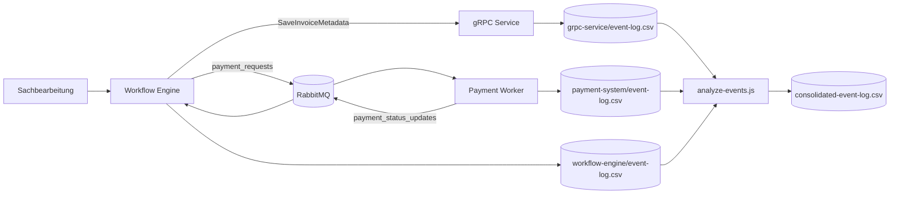

# Sprint 3 - Zielarchitektur mit Workflow-Engine

## Architekturidee

Die Workflow-Engine wird als prozessgesteuerte Anwendung zwischen Fachfreigabe, gRPC-Service und Payment-System eingefuehrt.

- Eingangsdaten werden weiterhin ueber den gRPC-Service persistiert.
- Die Workflow-Engine steuert den Prozesszustand (`PENDING_APPROVAL`, `PAYMENT_IN_PROGRESS`, `COMPLETED`).
- Payment bleibt asynchron ueber RabbitMQ.
- Rueckmeldungen aus dem Payment Worker werden als Status-Events an die Workflow-Engine gesendet.

## Architekturdiagramm (Mermaid)

## Technische Komponenten (Sprint 3)

- `workflow-engine/server.js`: REST-API fuer Start, Freigabe und Statusabfrage von Workflows
- `workflow-engine/event-logger.js`: Event-Log fuer Workflow-Events
- `payment-system/payment-worker.js`: erweitert um Status-Events in Queue `payment_status_updates`
- `client/workflow-client.js`: einfacher End-to-End-Demo-Client fuer den Workflow

## Endpunkte Workflow-Engine

- `POST /workflows/start`
- `POST /workflows/:workflowId/approve`
- `GET /workflows/:workflowId`
- `GET /workflows`

## Erwartetes Laufverhalten

1. Workflow wird gestartet und wartet auf Freigabe.
2. Nach Freigabe wird eine Zahlung angestossen.
3. Payment Worker verarbeitet die Zahlung und sendet ein Status-Event.
4. Workflow wird automatisch auf `COMPLETED` gesetzt.

Diese Architektur schafft die Grundlage fuer eine spaetere echte Workflow-Engine (z.B. Camunda, Temporal, Zeebe), ohne den aktuellen Projektstand zu verwerfen.
